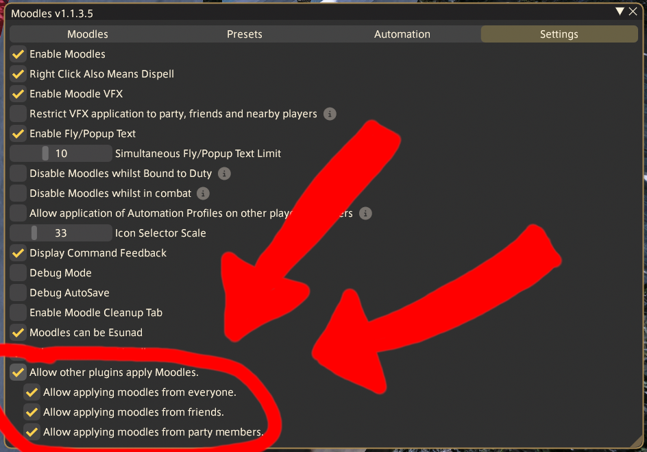
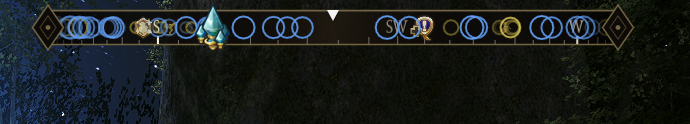
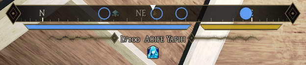
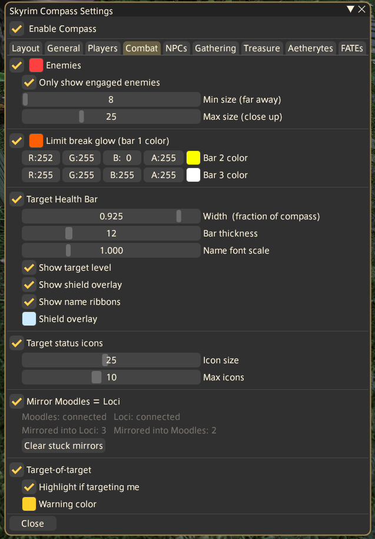

# Skyrim Compass

Whoa look, the first (somewhat) working compatibility layer for Loci and Moodles! Oh yeah, theres also a neat Skyrim-type compass if you care about that.

<p align="center">
  
</p>

## BEFORE YOU INSTALL (For moodles users)
In order to apply moodles, you MUST tick these boxes in Moodles settings

<p align="center">
  
</p>


## KNOWN ISSUES
- Moodles and Loci show the vfx twice when applying a status, like its applying them twice.

   Thats because it IS. It copies your moodles and locis so that they show for both, and hides the extra copy. 
- After using /xlkill some statuses randomly reappear on next login.

   TO FIX: Close the game normally once to save your character's "state".
- Moodle timers do not display a countdown unless "persist expire time" is enabled for the moodle.

   I couldnt find a fix for this. (The timer still works fine, just doesnt display)
- When "persist expire time" is enabled for a moodle, reapplying that moodle breaks a bit.

  TO FIX: remove the moodle before re-applying

- BUT WHAT ABOUT STATUS BRIDGE????

  Uninstall it. This replaces it. (you can disable everything except the status bar if you dont want the compass)

## Install

Add this URL as a custom plugin repository in Dalamud (Settings > Experimental > Custom Plugin Repositories), then install **Skyrim Compass** from the plugin list.

```
https://raw.githubusercontent.com/JTayGang/MeowyUtils/main/repo.json
```

---

## Features

- Scrolling N / NE / E / SE / S / SW / W / NW compass with degree tick marks
- Markers for players, enemies, NPCs, gathering nodes, treasure, aetherytes, and FATEs, using real game icons where available
- Party role icons and per player named overrides
- Skyrim style target health bar: name, level, shield overlay, and a damage flash on just the HP you lost
- Target of target tier with its own warning color when it's targeting you
- Limit break glow that creeps around the border as your gauge charges
- 5 built in color themes, or customize every color yourself

<p align="center">
  
  
</p>

---

## Configuration

Open with `/compass config`. Settings are split across tabs (Layout, General, Players, Combat, NPCs, Gathering, Treasure, Aetherytes, FATEs), and every option has a hover tooltip explaining what it does.

<p align="center">
  
</p>

---

## Commands

| Command | Effect |
|---|---|
| `/compass` | Toggle the compass on/off |
| `/compass on - /compass off` | For macro use if a big black box was covering your screen or something |
| `/compass config` | Open settings |

The settings window is also reachable from the Dalamud plugin list's gear icon.

---

## Building from source

Needs the [.NET 10 SDK](https://dotnet.microsoft.com/download/dotnet/10.0) (10.0.101+) and XIVLauncher with Dalamud v15+ run at least once.

1. Point `DALAMUD_HOME` at your Dalamud dev folder:
   ```cmd
   setx DALAMUD_HOME "%APPDATA%\XIVLauncher\addon\Hooks\dev"
   ```
2. Build:
   ```sh
   dotnet build -c Release
   ```
   Output lands in `bin\Release\net10.0-windows\`. The `Dalamud.NET.Sdk` package is fetched automatically, no manual DLL references needed.
3. In XIVLauncher, open Dalamud Settings > Experimental, add that output folder as a dev plugin folder, then enable **Skyrim Compass** from the plugin installer.

---

## Troubleshooting

- **N and S swapped**: Layout tab, set Rotation Offset to `180`.
- **Compass not showing**: make sure it's enabled, run `/compass`.
- **Build error, can't find Dalamud.dll**: confirm `DALAMUD_HOME` is set and XIVLauncher has been run at least once.
- **`System.Runtime` version mismatch**: install .NET SDK 10.0.101 or later.
- **API level mismatch after a Dalamud update**: bump `Dalamud.NET.Sdk` to the latest version and update `DalamudApiLevel` in `SkyrimCompass.json` to match.

---

## License

MIT. Do whatever you like with it.
